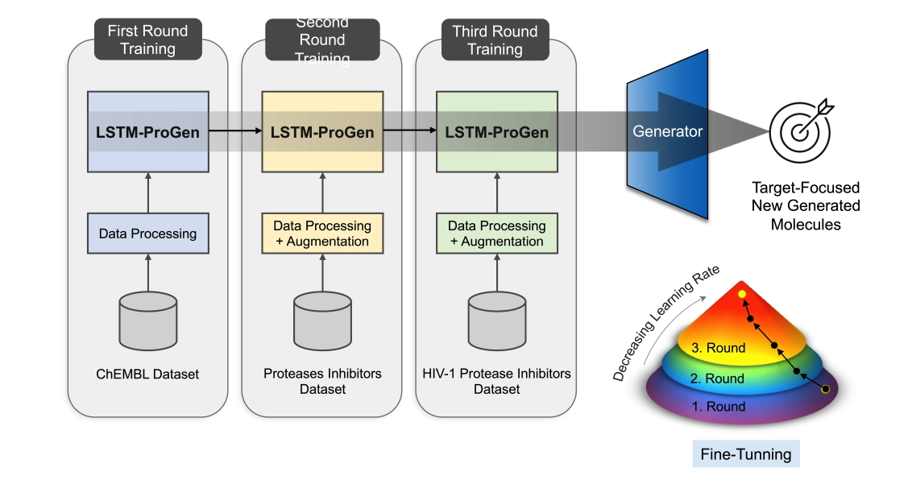

# LstmProGen
An LSTM-based model designed to generate novel anti-HIV drugs.

# Training Strategy

We trained this model through three rounds. First, we used the [ChEMBL 14k](https://www.ebi.ac.uk/chembl/web_components/explore/drugs/) drug dataset, then moved to a dataset of protease inhibitors, and finally focused on HIV-1 protease inhibitors. This training method aimed to guide the model to generate molecules similar to those in the training sets, focusing on the target properties. All datasets used are available in this repository, sourced from the extensive ChEMBL database, which contains a wealth of bioactive compounds with drug-like qualities and detailed information on their biological functions and molecular structures.

Our first dataset, "14K drug," contains around 14,000 small molecules with known drug-like properties. By training on this dataset, we aimed to ensure the model could effectively replicate drug-like features. We filtered out molecules that didn't match characteristics of known HIV-1 protease inhibitors, resulting in a dataset of 9480 molecules with relevant properties. For the second dataset, we filtered the "14K Drugs" dataset to include only molecules with similar mechanisms to HIV-1 protease inhibitors. This dataset ended up with 391 molecules, which were cleaned and used to train the model further. The final dataset consisted of 17 approved HIV-1 protease inhibitors. This dataset was used to fine-tune the model to produce compounds with both drug-like features and characteristics of HIV-1 protease inhibitors.

This is an overview of the training strategy that was followed to train our models.
